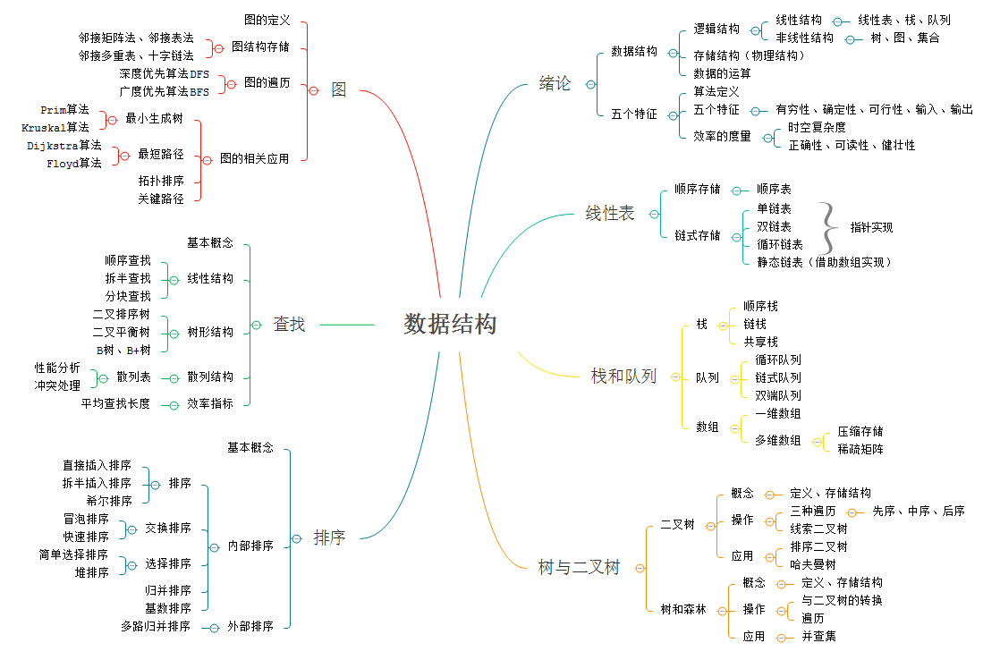

《数据结构》王道论坛 电子工业出版社

1. 绪论
2. 线性表 顺序表示、链式表示
3. 栈和队列
4. 树与二叉树
5. 图
6. 查找
7. 排序

## 第1章 绪论
### 1.1 数据结构的基本概念
### 1.2 算法和算法评价

## 第2章 线性表
### 2.1 线性表的定义和基本操作
### 2.2 线性表的顺序表示
### 2.3 线性表的链式表示

## 第3章 栈和队列
### 3.1 栈
### 3.2 队列
### 3.3 栈和队列的应用
### 3.4 特殊矩阵的压缩存储

## 第4章 树与二叉树
### 4.1 树的基本概念
### 4.1 二叉树的概念
### 4.1 二叉树的遍历和线索二叉树
### 4.1 树、森林
### 4.1 树与二叉树的应用

## 第5章 图
### 5.1 图的基本概念
### 5.2 图的存储及基本操作
### 5.3 图的遍历
### 5.4 图的应用

## 第6章 查找
### 6.1 查找的基本概念
### 6.2 顺序查找和折半查找
### 6.3 B树和B+树
#### 6.3.1 B树及其基本操作
B树，又称为多路平衡查找树，B树中所有结点的孩子结点数最大值称为B树的阶，通常用m表示。
一棵m阶B树或为空树，或为满足以下特性的m叉树：
1. 树中每个结点至多有m棵子树
2. 若根结点不是终端结点，则至少有两棵子树
3. 结点的子树个数等于关键字个数加1。关键字的个数等于子树的个数减1
4. 非叶结点数据结构（分支结点） n,P0,K1,P1,K2,P2,...,Kn,Pn。n关键字的个数。`n, P, K`
5. 所有叶结点出现在同一层次上，并且不带信息。

B树的查找
1. B树的高度（磁盘存取次数）
2. B树的查找
   * 多路分支查找，在B树中查找结点，磁盘上
   * 结点内查找，内存中
3. B树的插入
   * 定位
   * 插入
   * 分裂
4. B树的删除

#### 6.3.2 B+树基本概念
一棵m阶B树满足下列条件：
1. 每个分支结点最多有m棵子树
2. 非叶根结点至少有两棵子树，其他每个分支结点至少有m/2棵子树
3. 结点的子树个数与关键字个数相等
4. 所有分支结点仅包含它的各个叶子结点之中关键字的最大值及指向其子结点的指针。`Kmax, P`
5. 所有叶子结点包含全部关键字信息及指向相应记录的指针，而且叶结点中将关键字排序，并且相邻结点顺序链接

### 6.4 散列表
#### 6.4.1 散列表的基本概念
散列表是根据关键字而直接进行访问的数据结构。
发生冲突的不同关键字称为同义词。

#### 6.4.2 散列函数的构造方法
1. 直接定址法
2. 除留余数法
3. 数字分析法
4. 平方取中法
5. 折叠法

#### 6.4.3 处理冲突的方法
1. 开放定址法
   1. 线性探测法
   2. 平方探测法
   3. 再散列法
2. 拉链法（链接法，chaining）

#### 6.4.4 散列查找及性能分析
散列函数、处理冲突的方法和装填因子

装填因子 = 表中记录数n / 散列表长度m

### 6.5 字符串模式匹配

## 第7章 排序
### 7.1 排序的基本概念
### 7.2 插入排序
### 7.3 交换排序
### 7.4 选择排序
### 7.5 归并排序和基数排序
### 7.6 各种内部排序算法的比较及应用
### 7.7 外部排序