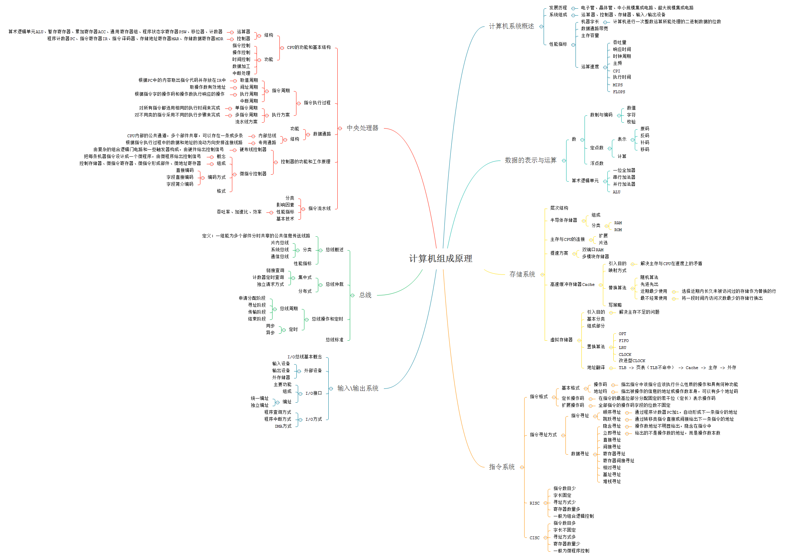

《计算机组成原理》王道论坛 电子工业出版社

1. 计算机系统概述
2. 数据的表示与运算
3. 存储系统
4. 指令系统
5. 中央处理器
6. 总线
7. 输入/输出系统

## 第1章 计算机系统概述
### 1.1 计算机发展历程
### 1.1 计算机系统层次结构
### 1.1 计算机性能指标

## 第2章 数据的表示与运算
### 2.1 数值与编码
### 2.2 定点数的表示与运算
### 2.3 浮点数的表示与运算
### 2.4 算术逻辑单元

## 第3章 存储系统
### 3.1 存储器的层次结构
### 3.2 存储器的层次化结构
### 3.3 半导体随机存储器
### 3.4 主存储器与CPU的连接
### 3.5 双端口RAM和多模块存储器
### 3.6 高速缓冲存储器
### 3.7 虚拟存储器

## 第4章 指令系统
### 4.1 指令格式
### 4.2 指令寻址方式
### 4.3 CISC和RISC的基本概念

## 第5章 中央处理器
### 5.1 CPU的功能和基本结构
### 5.2 指令执行过程
### 5.3 数据通路的功能和基本结构
### 5.4 控制器的功能和工作原理
### 5.5 指令流水线

## 第6章 总线
### 6.1 总线概述
### 6.2 总线仲裁
### 6.3 总线操作和定时
### 6.4 总线标准

## 第7章 输入/输出系统
### 7.1 IO系统的基本概念
### 7.2 外部设备
### 7.3 IO接口
### 7.4 IO方式