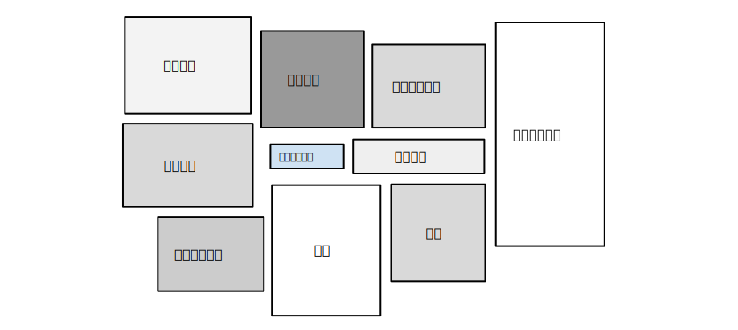

https://developers.google.cn/machine-learning/crash-course/ml-intro

## 1. 机器学习概念

### 框架处理
机器学习系统通过学习如何组合输入信息来对从未见过的数据做出有用的预测。

#### 标签
标签是我们要预测的事物，即简单线性回归中的 y 变量。标签可以是小麦未来的价格、图片中显示的动物品种、音频剪辑的含义或任何事物。

#### 特征
特征是输入变量，即简单线性回归中的 x 变量。简单的机器学习项目可能会使用单个特征，而比较复杂的机器学习项目可能会使用数百万个特征。

#### 样本
样本是指数据的特定实例：x。
- 有标签样本 同时包含特征和标签，使用有标签样本来训练模型。
- 无标签样本 包含特征，但不包含标签。

#### 模型
模型定义了特征与标签之间的关系。模型生命周期的两个阶段：
- **训练**是指创建或学习模型。
- **推断**是指将训练后的模型应用于无标签样本。

#### 回归与分类
回归模型可预测连续值。例如，回归模型做出的预测可回答如下问题：
加利福尼亚州一栋房产的价值是多少？
用户点击此广告的概率是多少？

分类模型可预测离散值。例如，分类模型做出的预测可回答如下问题：
某个指定电子邮件是垃圾邮件还是非垃圾邮件？
这是一张狗、猫还是仓鼠图片？

```py
y = f(x)
- y 标签
- x 特征
- 样本 x的特定实例，如x0, x1, ...
- f
```

### 深入理解机器学习

#### 线性回归
线性回归是一种找到最适合一组点的直线或超平面的方法。
y = m * x + b

#### 训练与损失
训练模型表示通过有标签样本来学习（确定）所有权重和偏差的理想值。

损失是一个数值，表示对于单个样本而言模型预测的准确程度。

#### 平方损失：一种常见的损失函数
平方损失（又称为 L2 损失）的损失函数。
```
  = the square of the difference between the label and the prediction
  = (observation - prediction(x))2
  = (y - y')2
```
均方误差 (MSE) 指的是每个样本的平均平方损失。

### 降低损失

迭代方法
梯度下降法
学习速率
随机梯度下降法

### 使用TF的基本步骤


```python
import tensorflow as tf

# Set up a linear classifier.
classifier = tf.estimator.LinearClassifier()

# Train the model on some example data.
classifier.train(input_fn=train_input_fn, steps=2000)

# Use it to predict.
predictions = classifier.predict(input_fn=predict_input_fn)
```

### 泛化
过拟合模型在训练过程中产生的损失很低，但在预测新数据方面的表现却非常糟糕。

### 训练集和测试集
- 训练集 - 用于训练模型的子集。
- 测试集 - 用于测试训练后模型的子集。

请勿对测试数据进行训练。 如果您的评估指标取得了意外的好结果，则可能表明您不小心对测试集进行了训练。例如，高准确率可能表明测试数据泄露到了训练集。

### 验证集
使用验证集评估训练集的效果。然后，在模型“通过”验证集之后，使用测试集再次检查评估结果。

### 表示法
传统编程的关注点是代码。在机器学习项目中，关注点变成了**特征表示**。也就是说，开发者通过添加和改善特征来调整模型。
- 将原始数据映射到特征
- 映射数值
- 映射分类值

### 特征组合
对非线性规律进行编码

特征组合是指通过将两个或多个输入**特征相乘来**对特征空间中的非线性规律进行编码的合成特征。“cross”（组合）这一术语来自 cross product（向量积）。

创建很多不同种类的特征组合。例如：
- [A X B]：将两个特征的值相乘形成的特征组合。
- [A x B x C x D x E]：将五个特征的值相乘形成的特征组合。
- [A x A]：对单个特征的值求平方形成的特征组合。

### 正则化：简单性


某个模型的训练损失逐渐减少，但验证损失最终增加。换言之，该泛化曲线显示该模型与训练集中的数据过拟合。根据奥卡姆剃刀定律，或许我们可以通过**降低复杂模型的复杂度**来防止**过拟合**，这种原则称为正则化。

```py
# 并非只是以最小化损失（经验风险最小化）为目标：
minimize(Loss(Data|Model))

# 而是以最小化损失和复杂度为目标，这称为结构风险最小化：
minimize(Loss(Data|Model) + complexity(Model))
```
训练优化算法是一个由两项内容组成的函数：一个是损失项，用于衡量模型与数据的拟合度，另一个是正则化项，用于衡量模型复杂度。

通过以下方式来调整正则化项的整体影响：用正则化项的值乘以名为 lambda（又称为正则化率）的标量。
```py
minimize(Loss(Data|Model) + lamda * complexity(Model))
```

### 逻辑回归

逻辑回归会生成一个介于 0 到 1 之间（不包括 0 和 1）的概率值，而不是确切地预测结果是 0 还是 1。
以用于检测垃圾邮件的逻辑回归模型为例。如果此模型推断某一特定电子邮件的值为 0.932，则意味着该电子邮件是垃圾邮件的概率为 93.2%。
更准确地说，这意味着在无限训练样本的极限情况下，模型预测其值为 0.932 的这组样本实际上有 93.2% 是垃圾邮件，其余的 6.8% 不是垃圾邮件。


### 分类

### 正则化：稀疏性

### 神经网络
神经网络是更复杂版本的特征组合。实质上，神经网络会学习适合的相应特征组合。
- 隐藏层
- 激活函数

输入 -> 隐藏层1 -> 非线性转换层（激活函数） -> 隐藏层2 -> 输出

#### 隐藏层
在下图所示的模型中，我们添加了一个表示中间值的“隐藏层”。隐藏层中的每个黄色节点均是蓝色输入节点值的加权和。输出是黄色节点的加权和。


#### 激活函数
要对非线性问题进行建模，我们可以直接引入非线性函数。我们可以用非线性函数将每个隐藏层节点像管道一样连接起来。


#### 总结
现在，我们的模型拥有了人们通常所说的“神经网络”的所有标准组件：
- 一组节点，类似于神经元，位于层中。
- 一组权重，表示每个神经网络层与其下方的层之间的关系。下方的层可能是另一个神经网络层，也可能是其他类型的层。
- 一组偏差，每个节点一个偏差。
- 一个激活函数，对层中每个节点的输出进行转换。不同的层可能拥有不同的激活函数。

### 训练神经网络

### 多类别神经网络

### 嵌入

## 2. 机器学习工程



### 静态训练与动态训练
从广义上讲，训练模型的方式有两种：
- 静态模型采用离线训练方式。也就是说，我们只训练模型一次，然后使用训练后的模型一段时间。
- 动态模型采用在线训练方式。也就是说，数据会不断进入系统，我们通过不断地更新系统将这些数据整合到模型中。

从广义上讲，静态训练和动态训练的选择由以下几点决定：
- 静态模型更易于构建和测试。
- 动态模型可以适应不断变化的数据。世界瞬息万变。基于去年的数据作出的销售预测很可能无法成功预测下一年的情况。

### 静态推理与动态推理

推理策略：
- 离线推理，指的是使用 MapReduce 或类似方法批量进行所有可能的预测。然后，将预测记录到 SSTable 或 Bigtable 中，并将它们提供给一个缓存/查询表。
- 在线推理，指的是使用服务器根据需要进行预测。

### 数据依赖性
机器学习系统的行为取决于其**输入特征**的行为和品质。当这些特征的输入数据发生更改时，模型也会随之变化。有时，这种变化是可取的，有时则反之。

在传统的软件开发中，更多地放在**代码**而非数据上。在机器学习开发中，虽然编码仍是工作的一部分，但必须同时**关注数据**。
例如，在传统的软件开发项目中，编写单元测试来验证代码是一种最佳做法。而在机器学习项目中，还必须不断地对输入数据进行测试、验证和监控。

### 公平性
评估机器学习模型
- 计算损失指标
- 训练数据是否存在偏差


