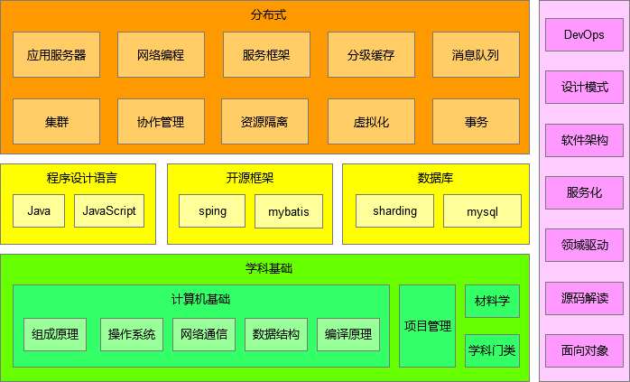
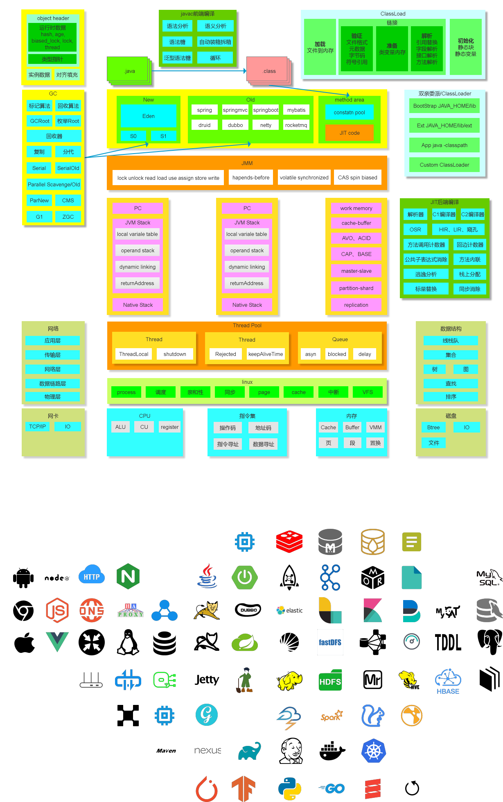
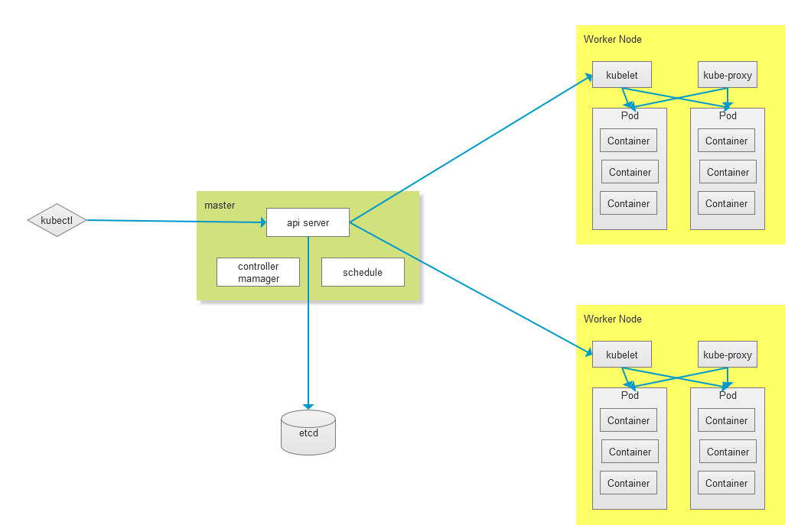

# development
Welcome to my notes.

* [https://gitee.com/onlyonion/development](https://gitee.com/onlyonion/development) 
* [https://onlyonion.gitee.io/development](https://onlyonion.gitee.io/development)
* [https://github.com/onlyonion/development](https://github.com/onlyonion/development) 
* [https://onlyonion.github.io/development](https://onlyonion.github.io/development)

## Overview
* [基础](00-base/README.md) 计算机专业基础，组成原理、数据结构、操作系统、计算机网络、编译原理
* [Java](10-java/README.md)  集合、IO、并发
* [框架](20-framework/README.md) spring系列、mybatis、tomcat、netty、apache系列
* [分布式](30-distributed/README.md) 从集中式到分布式系统，分布式理论、服务框架、消息队列、缓存、搜索
* [架构](40-architecture/README.md) 架构演进、架构设计、设计模式
* [数据库](50-database/README.md) 关系型数据库、NoSQL数据库，索引、事务、复制、分片，大数据处理
* [前端](60-js/README.md) JavaScript、NodeJS
* [开发运维](70-dev-ops/README.md)  DevOps，构建、部署、运行服务，集群监控、管理
<!-- * [工程项目](80-project/README.md)  -->
* [book](99-book/README.md)
  - [计算机类](99-book/notes/README.md) 计算机专业的书籍
  - [学科门类](99-book/subject/README.md) 以学科门类划分，13个学科门类的书籍

<!-- ## Links
* [易百教程](https://www.yiibai.com)
* [菜鸟教程](http://www.runoob.com)
* [w3school](http://www.w3school.com.cn)
* [infoq](https://www.infoq.cn)
* [jdon](https://www.jdon.com/)
* [阿里中间件团队博客](http://jm.taobao.org)
* [有赞技术团队](https://tech.youzan.com/)
* [美团技术团队博客](http://tech.meituan.com/) -->

## Java Stack
<!--  -->

<!--  -->